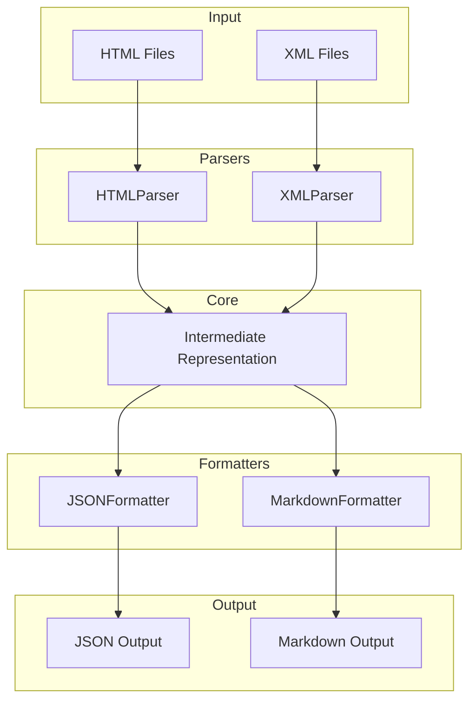

# Architecture Design

The Article Format Converter is designed as a modular pipeline to transform scientific articles from various input formats (HTML, XML) into a unified intermediate representation (IR), which can then be formatted into different output formats (JSON, Markdown).

## System Overview

## Core Components

### 1. Parsers
Parsers are responsible for reading source files and extracting structured data. Each parser implements a common interface to ensure compatibility with the core IR.
- **HTMLParser**: Optimized for Nature/Springer article layouts.
- **XMLParser**: Optimized for PubMed Central JATS XML format.

### 2. Intermediate Representation (IR)
A set of Pydantic models that define the structure of an article. This serves as the "source of truth" within the application, decoupling parsers from formatters.

The IR includes:
- Article metadata (title, DOI)
- Abstract
- Hierarchical sections with content
- Figures, tables, and supplementary materials

Note: Keywords, authors, affiliations, journal, and publication date are intentionally excluded from the IR to focus on the core scientific content. The DOI provides a unique identifier that can be used to retrieve full publication metadata if needed.

### 3. Formatters
Formatters take the IR and produce the final output.
- **JSONFormatter**: Produces a structured JSON representation of the article.
- **MarkdownFormatter**: Produces a human-readable Markdown file, including tables, figures (placeholders), and LaTeX math.

### 4. CLI Interface
A Click-based command-line interface that provides commands for single-file and batch conversion.

## Data Flow
1. The user specifies an input file or directory via the CLI.
2. The system detects the input format (based on file extension or user override).
3. The appropriate **Parser** is instantiated and processes the input.
4. The Parser returns an **Article** object (IR).
5. The specified **Formatter** takes the Article object and generates the output string.
6. The CLI writes the output to the destination.
